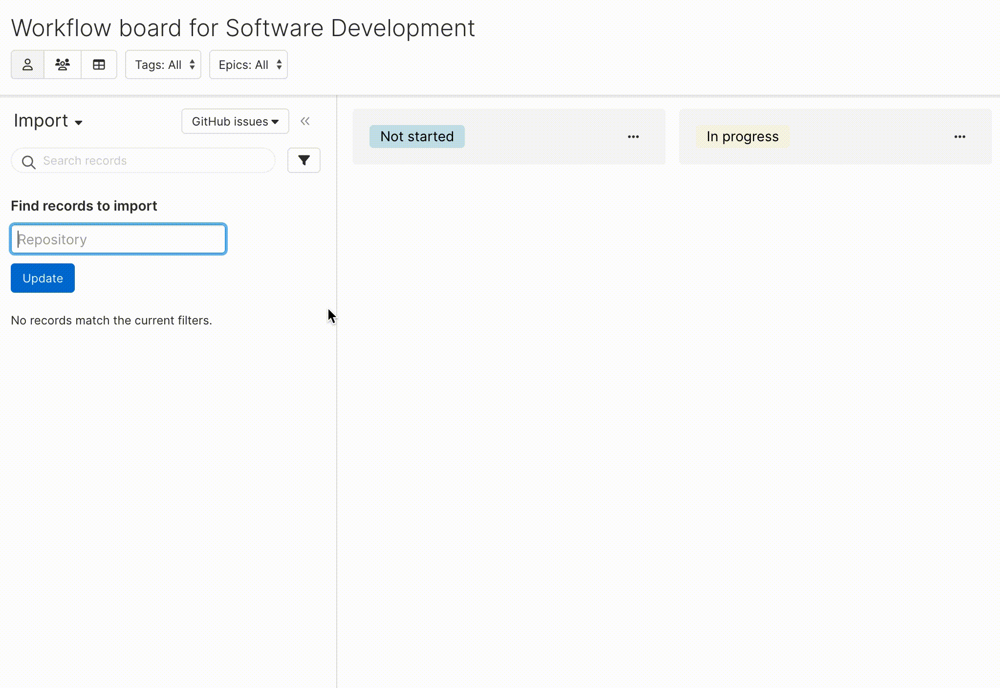

# GitHub Issues Importer

This [Aha! Develop](https://www.aha.io/develop/overview) extension enables a way to bring GitHub issues into Aha!. You can import from both private and public repositories, and it will bring over the title and description from the imported issue. 

It provides the `aha-develop.github-import.issues` [importer contribution]().

## Demo



## Installing the extension

**Note: In order to install an extension into your Aha! Develop account, you must be an account administrator.**

Install the GitHub Issues importer extension by clicking [here](https://secure.aha.io/settings/account/extensions/install?url=https%3A%2F%2Fsecure.aha.io%2Fextensions%2Faha-develop.github-import.gz).

## Working on the extension

Install `aha-cli`:

```sh
 npm install -g @aha-app/aha-cli
```

Clone the repo:

```sh
git clone https://github.com/aha-develop/github-import.git
```

**Note: In order to install an extension into your Aha! Develop account, you must be an account administrator.**

Install the extension into Aha! and set up a watcher:

```sh
aha extension:install
aha extension:watch
```

Now, any change you make inside your working copy will automatically take effect in your Aha! account.

When you are finished working on your extension, build it so that others can install it through its URL:

```sh
aha extension:build
```

To learn more about developing Aha! Develop extensions, including the API reference, the full documentation is located here: [Aha! Develop Extension API]()
